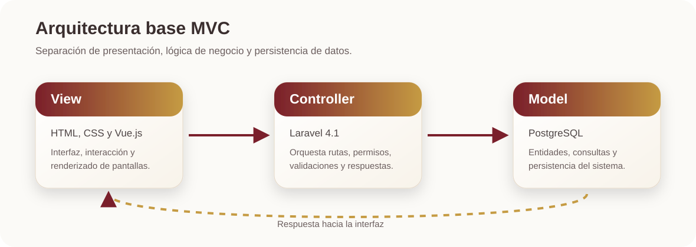

<div align="center">

# Sistema de la Unidad de Inteligencia Financiera

**SUIF** es una aplicación web orientada a la gestión del proceso de certificación. El proyecto conserva un stack legacy controlado, por lo que las decisiones técnicas deben priorizar estabilidad, compatibilidad y cambios acotados.


</div>

---

## Índice

- [Descripción general](#descripción-general)
- [Stack técnico](#stack-técnico)
- [Arquitectura](#arquitectura)
- [Módulos principales](#módulos-principales)
- [Configuración local](#configuración-local)
- [Base de datos](#base-de-datos)
- [Convenciones de desarrollo](#convenciones-de-desarrollo)
- [Flujo de trabajo recomendado](#flujo-de-trabajo-recomendado)

---

## Descripción general

El **Sistema de la Unidad de Inteligencia Financiera** centraliza flujos operativos y administrativos mediante una arquitectura **MVC**. Su objetivo es separar claramente la presentación, la lógica de negocio y la persistencia de datos para facilitar mantenimiento, revisión y crecimiento controlado del sistema.

---

## Stack técnico

| Capa | Tecnología | Versión / criterio | Uso principal |
|---|---|---:|---|
| Lenguaje backend | PHP | 7.1 | Lógica del servidor y compatibilidad con el ambiente disponible. |
| Framework backend | Laravel | 5.5 | Rutas, controladores, modelos y estructura MVC basada en framework. |
| Frontend base | HTML | — | Maquetación de vistas. |
| Estilos | CSS propio | — | Diseño visual del sistema sin depender de frameworks externos. |
| Interactividad | JavaScript | Moderno compatible | Comportamientos dinámicos del lado cliente. |
| Componentes frontend | Vue.js | Según integración actual | Componentes e interacciones controladas. |
| Base de datos | PostgreSQL | 16 | Persistencia de información. |
| Patrón | MVC | — | Separación de responsabilidades. |

---

## Arquitectura

<div align="center">
  
</div>

### Lectura rápida de la arquitectura

| Componente | Responsabilidad | Debe evitar |
|---|---|---|
| **View** | Mostrar datos, formularios, tablas, estados e interacciones visuales. | Consultar directamente la base de datos o meter lógica pesada. |
| **Controller** | Recibir solicitudes, validar, coordinar modelos y devolver respuestas. | Convertirse en archivo gigante con lógica mezclada y repetida. |
| **Model** | Representar entidades, consultas y reglas cercanas a datos. | Renderizar HTML o depender de detalles visuales. |
| **PostgreSQL** | Guardar la información estructurada del sistema. | Recibir datos sin validar desde formularios. |

---

## Módulos principales

| Módulo | Descripción | Prioridad técnica |
|---|---|---:|
| Participante | Flujo de usuario participante, captura de información y seguimiento. | Alta |
| Administrador | Gestión de usuarios, revisión de registros, permisos y operaciones internas. | Alta |
| Reportes / consultas | Consulta estructurada de información relevante para operación. | Media |

---

## Configuración local

### Requisitos previos

| Requisito | Versión recomendada | Comentario |
|---|---:|---|
| PHP | 7.1.x | Usar la misma versión objetivo del servidor para evitar sorpresas. |
| Servidor web | Apache / Nginx | Apache suele ser la opción más directa. |
| PostgreSQL | 16 | Verificar credenciales y extensión PHP (`pdo_pgsql` / `pgsql`). |
| Navegador | Actual | Para validar interfaz, estilos e interacciones. |

### Pasos generales

1. Clona o copia el proyecto en tu ambiente local.
2. Ejecuta `composer install` para instalar las dependencias.
3. Crea tu archivo `.env` basado en `.env.example` y genera la clave de aplicación con `php artisan key:generate`.
4. Configura el virtual host o servidor web apuntando a la carpeta `public/`.
5. Verifica que PHP tenga habilitada la extensión necesaria para PostgreSQL (`pdo_pgsql`).
6. Levanta el servidor local con `php artisan serve` o tu servidor local configurado.
7. Accede al sistema desde el navegador y prueba login, rutas principales y módulos críticos.

```bash
# Ejemplo general. Ajustar según el ambiente local.
cd ruta/del/proyecto/suif
php -v
```

> [!WARNING]
> No agregues dependencias nuevas ni ejecutes instalaciones que modifiquen el proyecto sin confirmar primero. El stack está deliberadamente limitado por compatibilidad.

---

## Base de datos

Motor principal: **PostgreSQL**.

| Dato | Valor esperado |
|---|---|
| Motor | PostgreSQL 16 |
| Configuración Laravel | Archivo `.env` |
| Charset recomendado | UTF-8 |
| Respaldo antes de cambios | Obligatorio en ambientes compartidos |
| Cambios estructurales | Documentados y revisados antes de aplicar |

### Buenas prácticas para cambios en base de datos

- Evitar cambios destructivos sin respaldo.
- Usar nombres claros y consistentes.
- Validar impacto en vistas, controladores y consultas existentes.
- Probar con datos similares a producción antes de entregar.

---

## Convenciones de desarrollo

| Elemento | Convención | Ejemplo |
|---|---|---|
| Variables PHP | `snake_case` | `$usuario_actual` |
| Funciones | `snake_case` | `obtener_registros()` |
| Clases | `StudlyCase` | `UsuarioController` |
| Archivos CSS | Nombres descriptivos | `panel_administrador.css` |
| Commits | Mensajes claros | `feat: agrega tabla de mejoras` |
| Cambios | Acotados a la tarea | No mezclar refactor, diseño y lógica en el mismo cambio. |

---

## Flujo de trabajo recomendado

| Paso | Acción | Resultado esperado |
|---:|---|---|
| 1 | Revisar tarea asignada | Entender alcance y criterio de aceptación. |
| 2 | Crear rama o respaldo | Evitar romper el avance principal. |
| 3 | Modificar solo archivos necesarios | Mantener cambios pequeños y revisables. |
| 4 | Probar manualmente el flujo afectado | Confirmar que no se rompió funcionalidad cercana. |
| 5 | Revisar compatibilidad con PHP 7.1 | Evitar sintaxis moderna incompatible. |
| 6 | Documentar cambios relevantes | Facilitar mantenimiento futuro. |

---

## Reglas de compatibilidad

| Evitar | Motivo | Alternativa |
|---|---|---|
| Sintaxis incompatible con PHP 7.1 | PHP 7.1 no la soporta. | Usar sintaxis compatible con 7.1. |
| Dependencias Composer nuevas | Puede romper la compatibilidad con PHP 7.1. | Reutilizar lo existente o pedir autorización. |
| Bundlers npm nuevos | No forman parte del stack definido. | CSS/JS integrado de forma controlada. |
| Refactors masivos | Aumentan riesgo y dificultan revisión. | Cambios pequeños por módulo. |
| Mezclar lógica en vistas | Rompe MVC. | Mover lógica a controlador/modelo. |

---

## Seguridad mínima esperada

| Riesgo | Medida recomendada |
|---|---|
| Acceso no autorizado | Validar sesión y permisos por ruta. |
| Datos inválidos | Validar entradas del usuario antes de guardar. |
| Exposición de errores | Evitar mostrar errores internos en producción. |
| Credenciales visibles | No subir contraseñas, tokens o dumps sensibles. |
| Cambios no rastreables | Documentar ajustes y mantener commits claros. |

---

## Criterios de trabajo

Este proyecto debe mantenerse bajo tres principios:

1. **Compatibilidad primero.** Si el servidor usa PHP 7.1, el código debe respetarlo.
2. **Cambios pequeños y controlados.** Cada ajuste debe poder revisarse sin arqueología digital.
3. **Sin dependencias sorpresivas.** No introducir Composer, npm, frameworks PHP, scaffolding Vue, linters o bundlers nuevos sin autorización explícita y validación en PHP 7.1.

---

<div align="center">

</div>
